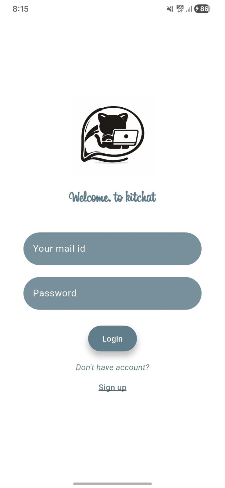
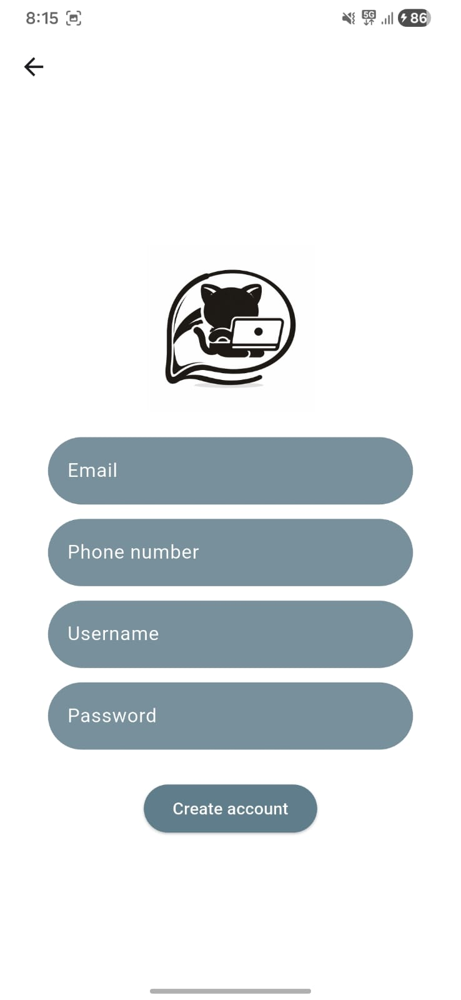
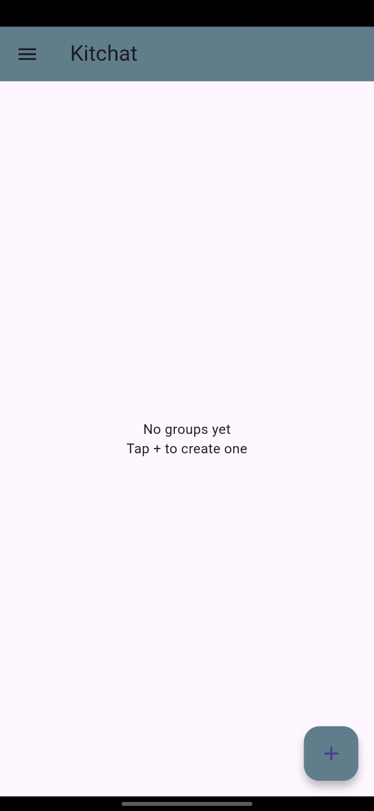
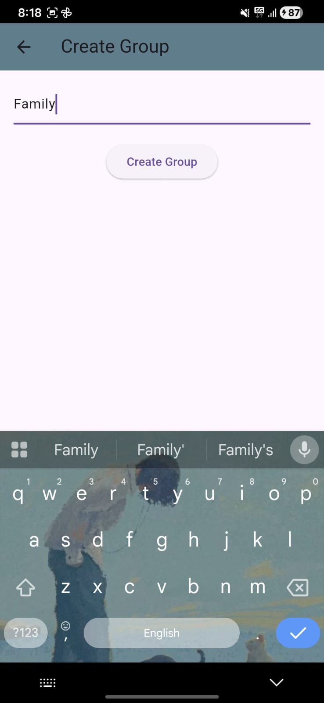
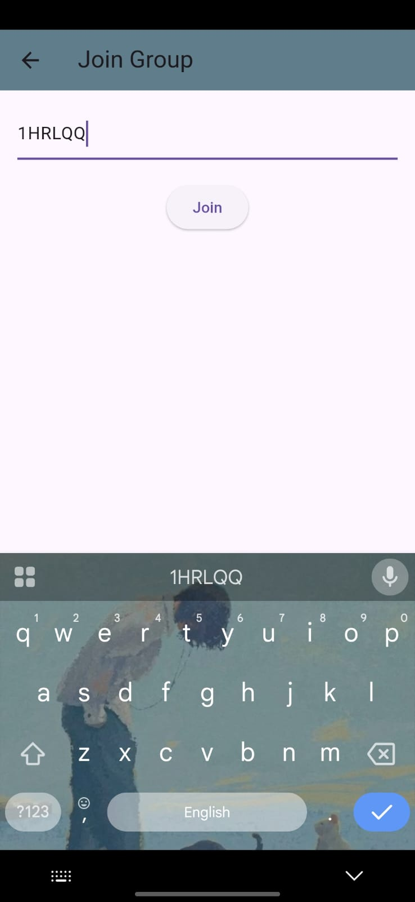
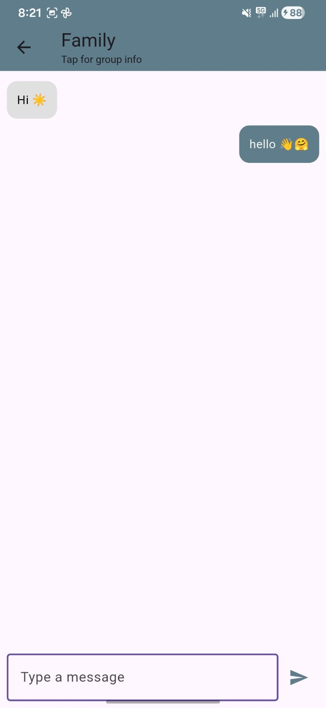
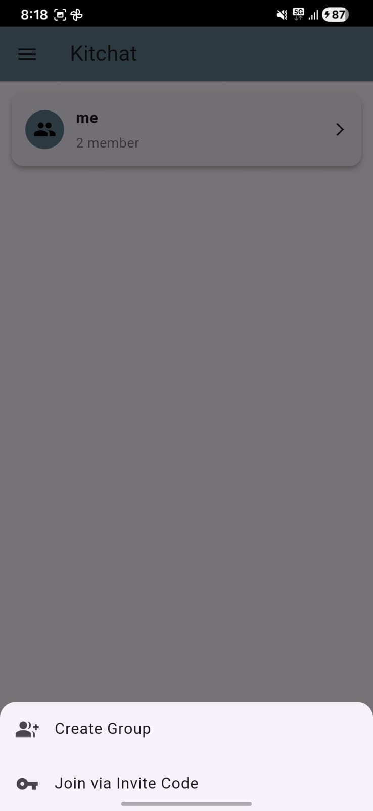

# 💬 KitChat – Group Chat Mobile Application

KitChat is a Flutter-based **real-time group chat application** built using **Firebase Authentication and Cloud Firestore**.  
The app enables secure user login and instant messaging with a clean, responsive UI.

This project demonstrates **authentication workflows, real-time database integration, and dynamic UI updates** in Flutter.

---

## ✨ Features

- 🔐 Secure user authentication (Email & Password)
- 💬 Real-time group messaging using Firestore
- 🔄 Instant UI updates without manual refresh
- 📱 Clean and responsive Material UI
- 🔁 Persistent login sessions
- 🚪 Logout functionality

---

## 🛠 Tech Stack

- **Flutter**
- **Dart**
- **Firebase Authentication**
- **Cloud Firestore**
- **Material UI**
- **Git & GitHub**

---

## 🔄 App Flow

1. User registers or logs in
2. Firebase verifies authentication
3. Logged-in users enter group chat
4. Messages sync in real time
5. User can logout anytime

---

## 📱 App Screenshots

| Login Screen | Chat Screen | Group Chat |
|-------------|------------|------------|
|  |  |  |
|  |  |  |
|  |  |  |

---

## 👤 Author

**Nikita Mandal**  
Flutter Developer | UI/UX Enthusiast
